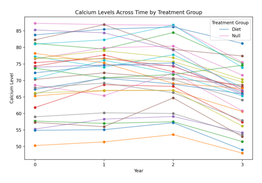

```{r}
#| label: loadPackages
#| warning: false

# Load necessary packages for data wrangling, web scraping, and visualization
library(tidyverse)
library(rvest)
library(knitr)
library(kableExtra)
library(scales)
library(patchwork)

```

## Busiest Airports Analysis

In this analysis, we will be comparing some of the busiest airports in the world based on passenger traffic. The data was taken from [Wikipedia](https://en.wikipedia.org/wiki/List_of_busiest_airports_by_passenger_traffic) and was web scraped using the `{rvest}` package. Specifically, we will be looking at the following airports from 2020 to 2025:

-   Hartsfield-Jackson Atlanta International Airport (ATL)
-   Beijing Daxing International Airport (PKX)
-   Frankfurt Airport (FRA)
-   Tokyo Haneda Airport (HND)
-   Seattle-Tacoma International Airport (SEA)
-   Los Angeles International Airport (LAX)

```{r}
#| label: loadAndScrapeAirportData
#| warning: false
#| 

# Section 1: Busiest Airports Analysis
# -----------------------------------------------------------------
# URL that we will be web scraping from for our data
baseURL <- "https://en.wikipedia.org"
specificURL <- "/wiki/List_of_busiest_airports_by_passenger_traffic"

wikiLink <- paste0(baseURL, specificURL)

# Read the HTML content from the Wikipedia page and extract the tables
wikiRawList <- read_html(x = wikiLink) |>
  html_elements(css = "table") |>
  html_table()

# Assign the relevant tables to variables for each year
allStats2025 <- wikiRawList[[1]]
allStats2024 <- wikiRawList[[2]]
allStats2023 <- wikiRawList[[3]]
allStats2022 <- wikiRawList[[4]]
allStats2021 <- wikiRawList[[5]]
allStats2020 <- wikiRawList[[6]]

# Define the list of airports we want to focus on for our analysis
airports <- c(
  "Hartsfield–Jackson Atlanta International Airport",
  "Frankfurt Airport",
  "Beijing Daxing International Airport",
  "Tokyo Haneda Airport",
  "Seattle–Tacoma International Airport",
  "Los Angeles International Airport"
)

# Create a function to clean the airport data for each year, filtering for the 
# specified airports, renaming columns, and converting passenger counts to 
# numeric values
clean_airport_data <- function(airportData, year) {
  airportData |>
    filter(Airport %in% airports) |>
    rename(TotalPassengers = Totalpassengers) |>
    mutate(
      TotalPassengers = parse_number(TotalPassengers),
      Year = year
    ) |>
    dplyr::select(Airport, TotalPassengers, Year)
}

# Apply the cleaning function to each year's data and combine the cleaned data 
# into one data frame for analysis
cleanStats2025 <- clean_airport_data(allStats2025, 2025)
cleanStats2024 <- clean_airport_data(allStats2024, 2024)
cleanStats2023 <- clean_airport_data(allStats2023, 2023)
cleanStats2022 <- clean_airport_data(allStats2022, 2022)
cleanStats2021 <- clean_airport_data(allStats2021, 2021)
cleanStats2020 <- clean_airport_data(allStats2020, 2020)

fullCleanData <- bind_rows(cleanStats2025, cleanStats2024,
                           cleanStats2023, cleanStats2022,
                           cleanStats2021, cleanStats2020)

```

Below, in @fig-cleanDataTable, we can see the passenger traffic totals for the six major airports over the last six years. The data was cleaned and organized using the `{tidyverse}` package, and the table was formatted using `{kableExtra}` for better readability.

```{r fig.width = 10, fig.height = 6}
#| label: fig-cleanDataTable
#| fig-cap: "Passenger Traffic Totals For Six Major Airports over Last 6 Years"
#| fig-align: "center"

# Create a table to display the cleaned data for passenger traffic totals
# for the six major airports over the last six years
fullCleanDataTable <- fullCleanData |>
  pivot_wider(
    names_from = Year,
    values_from = TotalPassengers
  ) |>
  mutate(
    across(where(is.numeric), comma)
  )

# Display the table using kable and kableExtra for better formatting
fullCleanDataTable |>
  knitr::kable(
    align = "lcccccc"
  ) |>
  kable_classic(
    lightable_options = "striped",
    font_size = 8
  )

```

The table above provides a clear overview of the passenger traffic trends for the six major airports from 2020 to 2025. To visualize these trends more effectively, we can create a line plot using `{ggplot2}`, as seen in @fig-passengerTrafficPlot, to compare the annual totals for each airport over the years.



```{r fig.width = 10, fig.height = 6}
#| label: fig-passengerTrafficPlot
#| fig-cap: "Passenger Traffic Trends for Six Major Airports (2020-2025)"
#| fig-alt: "Line graph showing passenger traffic trends from 2020 to 2025 for six major airports with distinct colored lines."

# Create a line plot to visualize the passenger traffic trends for the six
# major airports from 2020 to 2025
ggplot(fullCleanData) +
  aes(x = Year, y = TotalPassengers, colour = Airport) +
  geom_line(linewidth = 0.75) +
  geom_point(size = 2.5) +
  scale_y_continuous(labels = label_number(scale = 1e-6, suffix = "M")) +
  labs(
    x = "Year",
    y = "Total Passengers",
    title = "Passenger Traffic Trends for Six Major Airports",
    subtitle = "Comparing Annual Totals from 2020 to 2025"
  ) +
  theme_light() +
  theme(legend.text = element_text(size = 6))

```

When analyzing this data, the table (@fig-cleanDataTable) and line plot (@fig-passengerTrafficPlot) work together to illustrate how traffic passenger at the six major airports changed from 2020 to 2025. The table provides exact passenger counts while the plot makes it easier to see the overall trends in the data. One event that both the plot and table clearly show is that impact that the COVID-19 pandemic has on air travel, with very low passenger counts in 2020 and parts of 2021. Since then, the line plot helps to show the strong recoveries that most of the airports have had since then, especially Hartsfield-Jackson Atlanta International Airport, which increased from about 42.9 million passengers in 2020 to over 106 million in 2025. Overall, the combination of having a table to allow for precise comparisons and a line plot to highlight overall trends is a powerful tool and helps to accurately convey the passenger counts and trends for the six major airports over the last six years.

## Monte Carlo Numerical Integration

```{r}
#| label: monteCarloSetup

# Section 2: Monte Carlo Numerical Integration
# -----------------------------------------------------------------
# Function to generate random coordinates for Monte Carlo
# simulation using the Uniform distribution
generateCoordinates <- function(xMin, xMax, yMin, yMax, resolution) {
  coordinates <- as.data.frame(
    list(
      x = runif(n = resolution, min = xMin, max = xMax),
      y = runif(n = resolution, min = yMin, max = yMax)
    )
  )
  return(coordinates)
}

# Generate random coordinates for different resolutions and determine whether 
# they are above or below the Chi-Square distribution function by 
# comparing to the function's true values.
cords_10 <- generateCoordinates(0,20,0,0.16, 10) |>
  mutate(AboveBelow = ifelse(y <= dchisq(x, 5), "Below", "Above"))
cords_100 <- generateCoordinates(0,20,0,0.16, 100) |>
  mutate(AboveBelow = ifelse(y <= dchisq(x, 5), "Below", "Above"))
cords_1000 <- generateCoordinates(0,20,0,0.16, 1000) |>
  mutate(AboveBelow = ifelse(y <= dchisq(x, 5), "Below", "Above"))
cords_10000 <- generateCoordinates(0,20,0,0.16, 10000) |>
  mutate(AboveBelow = ifelse(y <= dchisq(x, 5), "Below", "Above"))

numPtsBelow_10 <- cords_10 |> filter(AboveBelow == "Below") |> count()
numPtsBelow_100 <- cords_100 |> filter(AboveBelow == "Below") |> count()
numPtsBelow_1000 <- cords_1000 |> filter(AboveBelow == "Below") |> count()
numPtsBelow_10000 <- cords_10000 |> filter(AboveBelow == "Below") |> count()

# Calculate the proportion of points that are on or below the 
# graph of the function
propBelowFunc_10 <- as.numeric(numPtsBelow_10[[1]] / 10)
propBelowFunc_100 <- as.numeric(numPtsBelow_100[[1]] / 100)
propBelowFunc_1000 <- as.numeric(numPtsBelow_1000[[1]] / 1000)
propBelowFunc_10000 <- as.numeric(numPtsBelow_10000[[1]] / 10000)

# Calculate the area of the rectangular window defined by the x and y 
# bounds which will be used to estimate the integral later.
areaOfRecWin <- (20 - 0) * (0.16 - 0)

```

This next section takes a look at a method of **Monte Carlo Integration** which is an technique for numeric integration. Numeric integration refers to the process of evaluating a definite integral and getting a number. In most calculus courses, students learn *deterministic* algorithms such as *Riemann Sums* or the *Trapezoidal Rule*. However, we can also use *stochastic* algorithms. Here's how the Monte Carlo simulation approach works:

Specifically, we will look at integration for the follow situation:\
**Function to Integrate**: PDF for Chi-Square Distribution\
**X-Bounds**: $0<=x<=20$\
**Y-Bounds**: $0<=y<=0.16$

1.  Plot the function over the bounds of integration to determine the bounds on the output. This will let us create a rectangular window to focus on.
2.  Find the area of the rectangular window as we'll need this number later.
3.  Set up the Monte Carlo Simulation
    i.  Randomly sample *n* x-coordinates using a Uniform distribution from the interval defined by the x-bounds of integration.
    ii. Randomly sample *n* y-coordinates using a Uniform distribution from the interval defined by y-bounds of integration to make a rectangle.
    iii. Take these two samples and join them together into one data frame.
4.  Identify whether each $(x,y)$ ordered pair is either above the function or on/below the function; that is, check whether $y > f(x)$ or if $y <= f(x)$
5.  Calculate the proportion, $p$, of points that are on or below the graph of the function.
6.  Multiply the proportion $p$ by the area of the rectangle window to get an estimate for the integral.

After doing so, we can see how the estimate for the integral changes as we increase the resolution of our Monte Carlo simulation. Below, in @fig-monteCarloPlotSubFigures, we can see the results of the Monte Carlo simulation for different resolutions of *n* = 10, 100, 1000, and 10000 with each plot showing the randomly generated points colored by whether they are above or on/below the function.

```{r}
#| label: fig-monteCarloPlotSubFigures
#| fig-cap: "Monte Carlo Integration of Chi-Square Distribution for Different Resolutions"
#| fig-alt: "Four scatter plots showing Monte Carlo integration with Chi-Square distribution for sample sizes of 10, 100, 1000, and 10000, using pink and green dots to determine above or on/below the function."
#| fig-subcap: 
#|   - "$n = 10$"
#|   - "$n = 100$"
#|   - "$n = 1000$"
#|   - "$n = 10000$"
#| layout-ncol: 2
#| 

# Create scatter plots for each resolution of the Monte Carlo simulation, 
# showing points colored by whether they are above or on/below the function, 
# and include the true function curve for reference.
ggplot(cords_10) +
  aes(x = x, y = y, colour = AboveBelow) +
  geom_point() +
  scale_color_manual(values = c(Above = "#FF598E", Below = "#BFFF00")) +
  labs(
    title = paste("Monte Carlo Integration of Chi-Square Distribution, n =", 10),
    subtitle = paste("Est. Numerical Integration: ", 
                     propBelowFunc_10 * areaOfRecWin)
  ) +
  theme_minimal() + 
  theme(legend.position = "bottom") +
  stat_function(
    fun = dchisq,
    args = list(df = 5),
    xlim = c(0, 20),
    color = "black"
  )

# Same as above but for n = 100
ggplot(cords_100) +
  aes(x = x, y = y, colour = AboveBelow) +
  geom_point() +
  scale_color_manual(values = c(Above = "#FF598E", Below = "#BFFF00")) +
  labs(
    title = paste("Monte Carlo Integration of Chi-Square Distribution, n =", 100),
    subtitle = paste("Est. Numerical Integration: ", 
                     propBelowFunc_100 * areaOfRecWin)
  ) +
  theme_minimal() + 
  theme(legend.position = "bottom") +
  stat_function(
    fun = dchisq,
    args = list(df = 5),
    xlim = c(0, 20),
    color = "black"
  )

# Same as above but for n = 1000
ggplot(cords_1000) +
  aes(x = x, y = y, colour = AboveBelow) +
  geom_point() +
  scale_color_manual(values = c(Above = "#FF598E", Below = "#BFFF00")) +
  labs(
    title = paste("Monte Carlo Integration of Chi-Square Distribution, n =",
                  1000),
    subtitle = paste("Est. Numerical Integration: ", 
                     propBelowFunc_1000 * areaOfRecWin)
  ) +
  theme_minimal() + 
  theme(legend.position = "bottom") +
  stat_function(
    fun = dchisq,
    args = list(df = 5),
    xlim = c(0, 20),
    color = "black"
  )

# Same as above but for n = 10000
ggplot(cords_10000) +
  aes(x = x, y = y, colour = AboveBelow) +
  geom_point() +
  scale_color_manual(values = c(Above = "#FF598E", Below = "#BFFF00")) +
  labs(
    title = paste("Monte Carlo Integration of Chi-Square Distribution, n =",
                  10000),
    subtitle = paste("Est. Numerical Integration: ", 
                     propBelowFunc_10000 * areaOfRecWin)
  ) +
  theme_minimal() + 
  theme(legend.position = "bottom") +
  stat_function(
    fun = dchisq,
    args = list(df = 5),
    xlim = c(0, 20),
    color = "black"
  )

```

From the plot above (@fig-monteCarloPlotSubFigures), we can see that as the resolution increases, the Monte Carlo estimate becomes more clustered and stable around the true function. While the lower resolutions are more chaotic and have less accurate estimates, the higher resolutions are more tightly clustered and give estimates very close to 1 is the true value of the integral for this function. The increasing density of points within the curve as the sample size increases supports this reasoning and helps to show how the method of Monte Carlo integration converges to the true value of the integral with increased resolutions.

## Planning and Prompting GenAI Tools

For this section, we will make up a plan of steps to both tidy a data set as well as create a plot/graph for the data. Then, we will take that plan and use it to prompt a GenAI tool to do the work for us. The data set that we will be working with is a csv file called `calcium.csv` which contains data from a longitudinal study that followed 31 women over the course of four years in which 15 were apart of the null treatment group, and the other 16 having received special help with their diet and completing a regular exercise program.

### My Plan for GenAI Prompt:

**GOAL:** Take the given dataset and tidy the data, then create a plot/graph that would help explore the difference in ulnar calcium measurements across time and the two treatment groups.

1.  Load tidyverse package
2.  Read in the calcium.csv file
3.  Split up the data frame into two separate data frames, one for the null group and one for the diet group.
4.  For each of those data frames, add a column that will store the treatment group name (either "Null" or "Diet"). Also, add a column that will store an identifier for each participant.
5.  Drop rows with NA values in both of those data frames.
6.  Combine the two data frames back together into one data frame by rows.
7.  Pivot the data frame from wide to long format so that we have a column for Group, id, Year, and CalciumLevel.
8.  Edit the year column so that it is a numeric variable instead of a character variable.
9.  Create a line plot with points to show the change in calcium levels across time for each treatment group with the x-axis being the year, the y-axis being the calcium level, and the lines colored by treatment group



### Results from My GenAI Prompt:

{#fig-MyGenAIPlot fig-alt="Line graph showing calcium levels over four years with multiple colored lines for treatment groups Diet and Null"}

The plot above, @fig-MyGenAIPlot, was generated by ChatGPT as a result of the following prompting:

**Prompt**: Follow this plan using R and the given dataset and show the resulting plot:

--*plan from above*--

**ChatGPT Response**:

Here’s the plot generated from your dataset following the exact steps in your plan.

How to interpret it:

-   Each line represents one participant
-   The two colors represent the Null vs Diet groups
-   You can see how calcium levels change from Year 0 → Year 3

What stands out:

-   Both groups show variation, but you can start to visually compare:
-   Whether one group trends upward more
-   Whether one group declines less
-   The spread (variability) within each group



### Results from Generic GenAI Prompt:

{#fig-genericGenAIPlot fig-alt="Line graph titled Average Values per Column with fluctuating line across non-sequential x-axis labels"}

The plot above, @fig-genericGenAIPlot, was generated by ChatGPT as a result of the following prompting:

**Prompt**: Create a data visualization for these data, calcium.csv

**ChatGPT Response**: I created a visualization showing the average value of each column in your dataset. What this shows:

-   Each point represents the mean (average) of one column (y0, y1, y2, y3, etc.).
-   You can quickly compare which variables tend to have higher or lower values overall.
-   For example, some columns cluster around \~70–73, while others drop closer to \~65.

If you want something more insightful, I can also create:

-   Boxplots (to show spread and outliers)
-   Time series plots (if rows represent time/order)
-   Correlation heatmaps
-   Side-by-side comparisons (e.g., y0 vs y0.1)\
    Just tell me



### Comparing ChatGPT's Results from the Planned and Generic Prompts:

From the two plots above, we can see that the plot generated from the planned prompt (@fig-MyGenAIPlot) is more informative and easier to interpret than the plot generated from the generic prompt (@fig-genericGenAIPlot). The planned prompt resulted in a line plot that clearly shows the change in calcium levels across time for each *individual person*, allowing for easy comparison between the individuals. In contrast, the generic prompt resulted in a scatter plot of average values for each column, which does not provide any insight into the trends or differences between the treatment groups over time. However, the planned prompt did not accurately color the lines by treatment group, which is a minor issue that could be easily fixed with a more specific prompt. Overall, this comparison highlights the importance of having a clear and detailed plan when prompting GenAI tools, as it can lead to much more informative and useful visualizations.

## Reflection

So far in this course, we have learned many different topics that are more focused on the R programming but also many that can be applied to other aspects of learning and working. Some of these topics include things such as the PCIP System, accepted coding styles, data wrangling, data analysis, data visualizations, Open Science and its principles, reproducibility, and much more. Throughout the course, I think that I have enjoyed learning about data wrangling the most. This has been my favorite topic because I find it enjoyable but also very useful to be able to take a data set that is messy and difficult to understand, and turn it into something that can be used to create tables and/or plots that can uncover meaningful insights. One example of this, in HW 2.3, was when we had to wrangle two data sets that included information about the armed forces and their pay/ranks and eventually combine them into a table that contained very valuable and insightful information. I think that this unit was my favorite because it relied heavily on problem solving and trial-and-error which is oftentimes my favorite part about programming in general. Overall, I have really enjoyed this course so far because I have always wanted to have the tools to be able to conduct data wrangling and analysis for personal projects and this course's curriculum has done a great job in doing that.



## GenAI Usage Appendix

1.  Alt Text for Airport Line Plot (@fig-passengerTrafficPlot):

-   Tool: ASU AI Image Accessibility Creator
-   Date: 04-10-2026
-   Prompt: n/a
-   Response: "Line graph showing passenger traffic trends from 2020 to 2025 for six major airports with distinct colored lines."

2.  Alt Text for Monte Carlo Sub-Figures (@fig-monteCarloPlotSubFigures):

-   Tool: ASU AI Image Accessibility Creator
-   Date: 04-10-2026
-   Prompt: n/a
-   Response: "Four scatter plots showing Monte Carlo integration with Chi-Square distribution for sample sizes of 10, 100, 1000, and 10000, using pink and green dots to determine above or on/below the function."

3.  Alt Text for Planned GenAI Prompt Plot (@fig-MyGenAIPlot):

-   Tool: ASU AI Image Accessibility Creator
-   Date: 04-16-2026
-   Prompt: n/a
-   Response: "Line graph showing calcium levels over four years with multiple colored lines for treatment groups "Diet" and "Null"."

4.  Alt Text for Generic GenAI Prompt Plot (@fig-genericGenAIPlot):

-   Tool: ASU AI Image Accessibility Creator
-   Date: 04-16-2026
-   Prompt: n/a
-   Response: "Line graph titled "Average Values per Column" with fluctuating line across non-sequential x-axis labels."

5.  GenAI Plot from Planned Prompt (@fig-MyGenAIPlot):

-   Tool: ChatGPT
-   Date: 04-16-2026
-   Prompt: Follow this plan using R and the given dataset and show the resulting plot: --*plan from above*--
-   Response: The plot shown in @fig-MyGenAIPlot was generated by ChatGPT



## Code Appendix

```{r}
#| label: codeAppend
#| ref-label: !expr knitr::all_labels()
#| echo: true
#| eval: false
```
